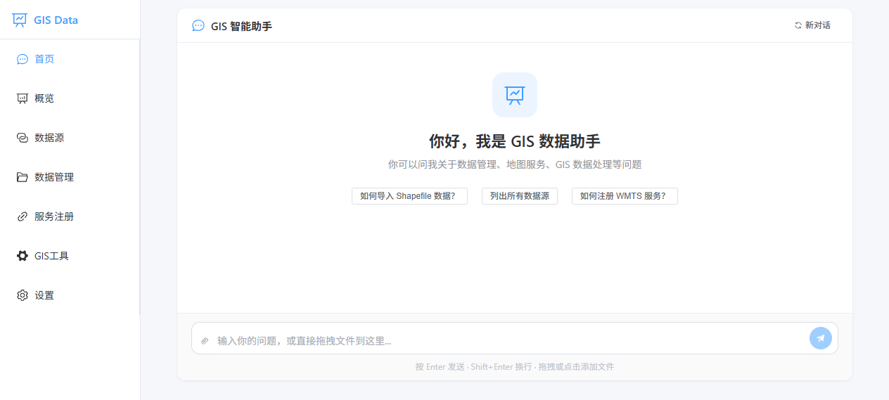
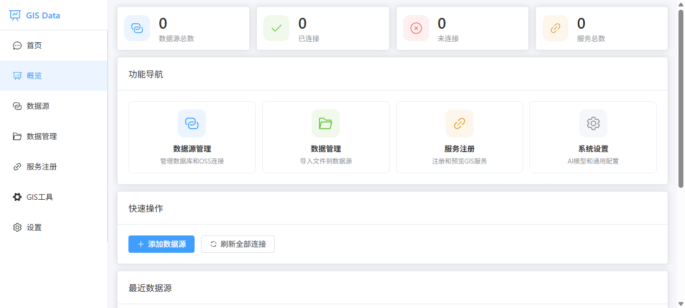
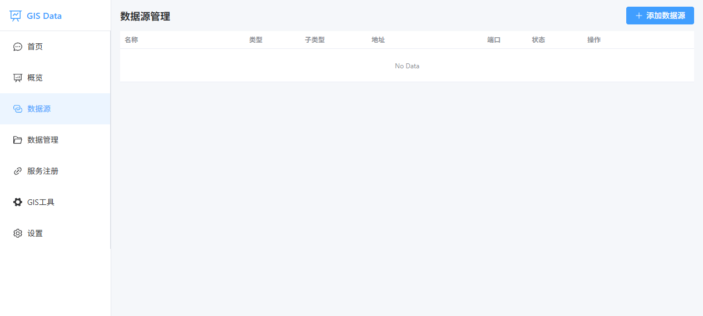
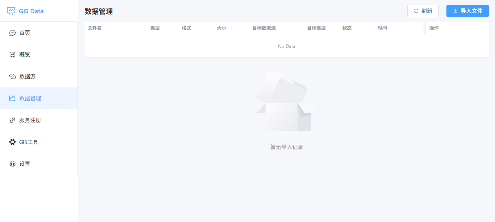
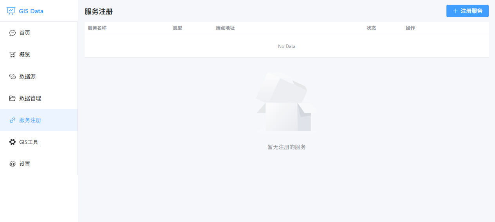
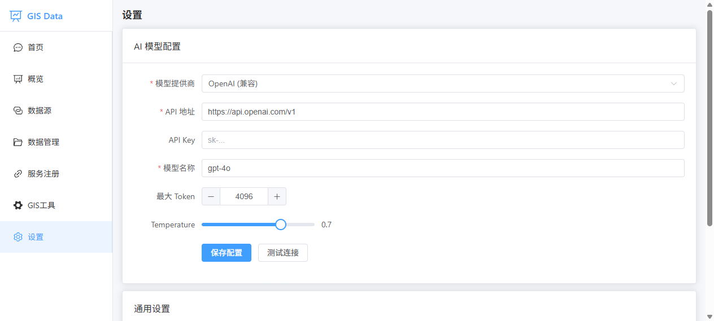

# GIS Data Manager

基于 Tauri 2 + Vue 3 的桌面 GIS 数据管理工具。

## 功能特性

### 数据源管理

- 支持 PostgreSQL/PostGIS、MySQL、SpatiaLite 数据库连接
- 支持阿里云 OSS、AWS S3、MinIO 等 S3 兼容对象存储
- 增删改查、一键连接测试、连接状态展示

### 数据管理

- 矢量文件（shp、geojson、gpkg、kml、kmz）导入到 OSS 数据源
- 文档文件（pdf、doc、xls、xlsx、csv、zip 等）导入到 OSS
- 支持从 OSS 下载已导入的文件
- 上传/下载进度实时反馈
- 导入历史记录查询与管理

### GIS 服务注册

- 支持 WMTS、TMS、WMS、WFS、GeoServer REST、ArcGIS REST 服务
- 连接测试、OpenLayers 地图预览
- 预置天地图、GeoServer 示例、OSM 公开服务

### GIS 工具箱

- 空间分析：缓冲区、裁剪、相交、并集
- 数据转换：转 Shapefile / GeoJSON / GeoPackage
- 坐标处理：坐标转换、投影定义
- 数据管理：统计、属性查询、图层合并、OGR 信息
- 栅格处理（GDAL）：重投影、转换/裁剪、信息查看、栅格计算、栅格转矢量
- 标签系统：`ai`（AI 辅助）/ `human`（手动）/ `both`（两者皆可）

### AI 助手

- 支持 OpenAI 兼容接口、Anthropic、Ollama、自定义 Endpoint
- 一键连接测试、内置 GIS 助手聊天接口
- 多轮对话与历史记录

## 技术栈

| 层 | 技术 |
| --- | --- |
| 前端框架 | Vue 3 + Vue Router 5 |
| UI 组件 | Element Plus |
| 地图预览 | OpenLayers (ol) |
| 桌面框架 | Tauri 2 |
| 本地存储 | SQLite (rusqlite) |
| 数据库连接 | sqlx (postgres / mysql / sqlite) |
| HTTP 请求 | reqwest |
| OSS SDK | minio-rs |
| 异步运行时 | tokio |

## 项目结构

```text
gis-data-manager/
├── src/                  # Vue 前端源码
│   ├── views/            # 页面组件（7 个路由页面）
│   ├── router/           # Vue Router 配置
│   ├── App.vue           # 根组件（侧边栏 + 路由）
│   └── main.js           # 入口
├── src-tauri/            # Rust 后端
│   ├── src/lib.rs        # 全部 Tauri 命令与业务逻辑
│   ├── src/main.rs       # 应用入口
│   ├── tauri.conf.json   # Tauri 配置
│   └── Cargo.toml        # Rust 依赖
├── package.json
└── vite.config.js
```

## 开发

### 环境要求

- [Rust](https://www.rust-lang.org/)（最新稳定版）
- [Node.js](https://nodejs.org/) 18+
- Windows 构建需安装 Visual Studio Build Tools（C++ 工作负载）

### 安装依赖

```bash
cd gis-data-manager
npm install
```

### 启动开发模式

```bash
npm run tauri:dev
```

### 构建生产版本

```bash
npm run tauri:build
```

产物位于 `src-tauri/target/release/bundle/`。

## 界面预览

### AI 助手首页



### 数据概览仪表盘



### 数据源管理页



### 数据管理页



### 服务注册页



### GIS 工具箱页


### 系统设置页



## License

MIT
